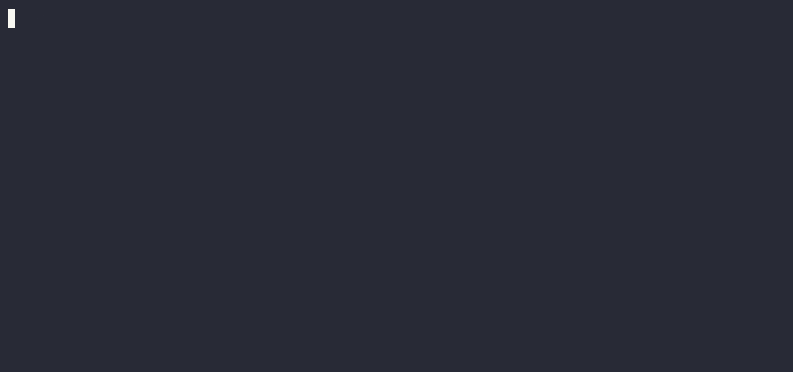
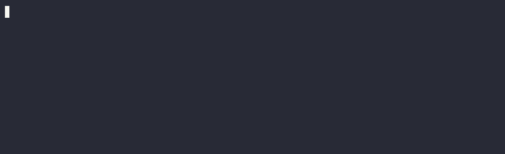

# AgentRisk

[](https://github.com/trycoin-ai/agentrisk/actions/workflows/ci.yml)
[](pyproject.toml)
[](LICENSE)

Risk guardrails for AI trading agents. Your agent proposes; your policy decides.



AgentRisk is risk infrastructure that sits in front of trade execution. It analyzes
portfolio risk, validates proposed trades against a personal risk policy, and manages
that policy. There is a hard line it never crosses:

> AgentRisk **never recommends trades and never executes them.** It is a guardrail,
> not a trading bot. A `PASS` means a trade did not break the rules *you* wrote, not
> that it is safe or profitable. See [DISCLAIMER.md](DISCLAIMER.md).

AgentRisk comes in three parts: a pure Python library (no network calls, no LLM
calls, no API keys), a thin [MCP](https://modelcontextprotocol.io) server that wraps
it, and an optional [Agent Skill](#agent-skill) that teaches a Claude agent when and
how to use them. Any MCP-capable agent (Claude or your own) can call three tools:

| Tool | Question it answers | Returns |
| --- | --- | --- |
| `analyze_portfolio_risk` | What risk am I holding? | Concentration, exposure, and policy-compliance report |
| `check_trade_risk` | Should this trade go through? | `PASS` / `WARN` / `BLOCK` with a one-line reason |
| `generate_risk_policy` | What are my rules? | A human-readable YAML policy (create, update, show) |

## Demos

Each tool from the terminal, using the bundled `agentrisk` CLI.

**Check a trade before it executes.** A normal buy passes, an over-limit buy is blocked, and a user-approved one-time bypass is allowed and logged.



**Analyze portfolio risk.** Concentration, exposure by sector and theme, and compliance against your policy.


**Create a risk policy.** Turn plain rules into a versioned, human-readable policy.


Try it yourself:

```bash
git clone https://github.com/trycoin-ai/agentrisk.git && cd agentrisk
pip install -e .
agentrisk policy init --preset balanced --max-position 25 --block crypto --block margin --warn options
agentrisk check buy 20 NVDA --at 120 --portfolio examples/sample_portfolio.json
agentrisk analyze examples/sample_portfolio.json --focus tag:ai
```

## Why

Agentic trading is arriving faster than agentic risk management. Every agent that can
place an order needs a policy gate in front of it. AgentRisk aims to be the boring,
deterministic, inspectable default for that gate:

- **Deterministic.** Same snapshot, same trade, same policy: byte-identical verdict,
  every time. No LLM in the core, so the whole engine is unit-, golden-, and
  property-tested.
- **Transparent.** Policies are YAML you can read and hand-edit. Every verdict lists
  the checks that ran, the limits, and the exact numbers.
- **Honest.** Unclassified holdings, stale data, and v1 limitations are reported in
  the output itself. Verdicts are advisory by nature, and the docs say so plainly.

## Installation

AgentRisk installs from this repository (a PyPI release will follow):

```bash
# straight from GitHub
pip install "agentrisk[mcp] @ git+https://github.com/trycoin-ai/agentrisk.git"

# or from a checkout
git clone https://github.com/trycoin-ai/agentrisk.git
cd agentrisk
pip install -e ".[mcp]"          # drop [mcp] for the library only
```

Requires Python 3.10+.

## Quickstart

```python
from agentrisk import generate_risk_policy, check_trade_risk

# 1. Create a policy. In an agent, the agent translates the user's words into fields.
generate_risk_policy(
    "create", preset="balanced",
    fields={"limits": {"max_single_position_pct": 25},
            "asset_rules": {"options": "warn", "margin": "block", "crypto": "block"}},
    confirm=True,
)

# 2. Check a proposed trade BEFORE executing it.
import json
portfolio = json.load(open("examples/sample_portfolio.json"))  # NVDA is 28.6% here

result = check_trade_risk(
    portfolio,
    {"action": "buy", "symbol": "NVDA", "quantity": 20,
     "order_type": "market", "estimated_price": 120},
)

# 3. Gate execution on the verdict. This step is what makes it a guardrail.
if not result.proceed:
    print(result.summary)
    # Blocked by AgentRisk: this trade would increase NVDA to 31.4% of your
    # portfolio, above your 25% single-name limit.
```

The counterfactual sell reduces the position and passes:

```text
Risk check passed. This sell reduces NVDA from 28.6% to 20% of your portfolio,
bringing it back under your 25% limit.
```

A portfolio snapshot is a plain JSON object; you supply the positions and prices,
and AgentRisk fetches nothing:

```json
{
  "as_of": "2026-07-01T15:30:00Z",
  "cash": 8000,
  "positions": [
    {"symbol": "NVDA", "quantity": 200, "price": 120},
    {"symbol": "MSFT", "quantity": 25, "price": 400}
  ]
}
```

Run the full propose / check / gate loop with a sample portfolio:

```bash
python examples/agent_loop.py
```

## Use with Claude Desktop or any MCP client

Register the server and ask questions in plain English; the agent translates them
into structured tool calls.

```json
{
  "mcpServers": {
    "agentrisk": {
      "command": "agentrisk-mcp"
    }
  }
}
```

See [examples/claude_desktop.md](examples/claude_desktop.md) for the two-minute
setup, and [docs/integration-guide.md](docs/integration-guide.md) for pairing
AgentRisk with a broker MCP server so trades are checked before they are placed.

## Agent Skill

For Claude agents, AgentRisk ships an optional Agent Skill that encodes the
discipline the guardrail depends on: before any order reaches a broker, classify
the proposed trade, call `check_trade_risk`, respect the verdict, and record the
result, in that order. The skill is thin and opinionated; the tool docstrings carry
the parameter detail.

The fastest way to get the skill and the MCP server together is the Claude Code
plugin, which also registers the server (via `uvx`, so there is nothing else to
install):

```text
/plugin marketplace add trycoin-ai/agentrisk
/plugin install agentrisk@agentrisk
```

Or install just the skill:

- **Claude Code or Claude Desktop:** copy `skills/agentrisk/` into `~/.claude/skills/`
  so it lives at `~/.claude/skills/agentrisk/SKILL.md`.
- **claude.ai:** upload `skills/agentrisk/SKILL.md` as a skill.

The plugin path needs [uv](https://docs.astral.sh/uv/) installed to provide `uvx`.

## The enforcement contract

AgentRisk returns advice. It cannot physically stop an order, so your integration
must gate execution on the verdict:

```python
result = check_trade_risk(portfolio, trade)
if not result.proceed:
    refuse(result.summary)              # BLOCK: never call the broker
elif result.acknowledgements_required:
    confirm_with_user(result)           # WARN: surface warnings first
else:
    execute(trade)                      # PASS
```

If you call the broker regardless of the verdict, you have a logger, not a
guardrail. Details in the [integration guide](docs/integration-guide.md).

## What it checks (v1)

- **Concentration caps.** Max single position, per-sector, per-theme, and
  per-asset-class limits, evaluated on the simulated post-trade portfolio.
- **Asset-class rules.** Allow, warn, or block for crypto, options, and margin.
- **Order sanity.** Max order size (percent and absolute), minimum cash floor,
  insufficient-funds detection.
- **Restricted symbols.** Never-trade and warn lists.
- **Data quality.** Stale snapshots warn; invalid snapshots fail closed to BLOCK.

Safety behaviors worth knowing:

- **Fail closed.** No policy or invalid input produces BLOCK, never a silent pass.
- **Exits are never trapped.** Selling is never blocked by a concentration or
  asset-class rule, even when the policy blocks buying that asset.
- **Only breach-worsening trades block.** If a position is already over its cap,
  a trade that reduces the breach passes with a note.
- **One-time bypass, not silent override.** A human can approve a single blocked
  trade with `check_trade_risk(override=[...])` without changing the policy. Blocks
  are tiered (tunable limits bypass directly; hard prohibitions steer you to a policy
  edit first; feasibility blocks cannot be bypassed), and every bypass is logged.

## Documentation

| Doc | Contents |
| --- | --- |
| [Concepts](docs/concepts.md) | The mental model and the agent/AgentRisk division of labor |
| [Architecture](docs/architecture.md) | The module layout and how a call flows through the core |
| [Policy reference](docs/policy-reference.md) | Every policy field and the check behavior it drives |
| [Tool reference](docs/tool-reference.md) | Parameters, outputs, and error cases for all three tools |
| [CLI reference](docs/cli.md) | The `agentrisk` command: `policy`, `check`, `analyze` |
| [Integration guide](docs/integration-guide.md) | The enforcement contract, broker MCP pairing, audit log |
| [Threat model](docs/threat-model.md) | What AgentRisk can and cannot protect against |
| [Classification data](docs/classification-data.md) | The open taxonomy and how to contribute corrections |

## Roadmap

- **v0.2**: deterministic stress scenarios ("tech -20%"), ETF look-through for
  duplicated-risk detection, behavioral limits (max trades/day, turnover) built on
  the audit log.
- **v0.3**: options analytics (notional, max loss, simple delta), read-only broker
  snapshot adapters as separate optional packages, short positions, multi-currency.
- **Never**: trade recommendations, signals, execution, or telemetry.

## Contributing

Contributions are welcome, especially classification-data corrections and new
deterministic checks. See [CONTRIBUTING.md](CONTRIBUTING.md). Please keep the core
pure: no network, no LLM calls, no hidden state.

## License

MIT. See [LICENSE](LICENSE).
